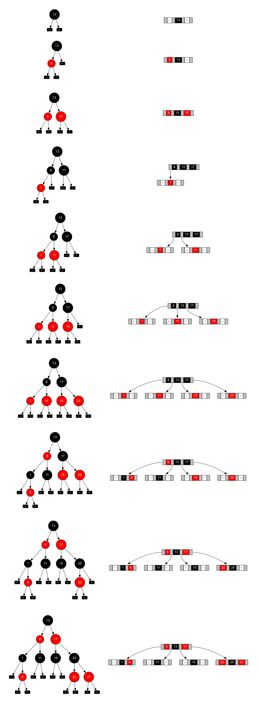

# TreeDemo-0.1
## About the project
A simple demonstration of [Red-black trees](http://en.wikipedia.org/wiki/Red–black_tree) and their analogy to [B-trees of order 4](http://en.wikipedia.org/wiki/B-tree) (also known as 2,4-trees). Features include:

* interactive shell for tree operations
* visualization of Red-black tree and the corresponding B-tree using [Graphviz](http://www.graphviz.org)
* automatically indexed visualizations are saved after each command

## Compatibility
This project was created in Xcode 5.1.1 and tested on Apple LLVM 5.1 with GNU++11 dialect. In order to successfully run the demo, Graphviz command line utility `dot` version 2.36 or newer is required. 

## Acknowledgements
I would like to thank my family for enabling me to complete this project and my colleagues for their kind help and clever insights.

## Purpose
This utility was created as a university project and was ment to be used mainly in academic environment for educational purposes. If you wish to use it otherwise, you are free to do so. However, I would like to emphasize that there is no warranty or support of any kind.

## License (MIT)
Copyright (c) 2014 Petr Mánek, Charles University in Prague.

Permission is hereby granted, free of charge, to any person obtaining a copy of this software and associated documentation files (the "Software"), to deal in the Software without restriction, including without limitation the rights to use, copy, modify, merge, publish, distribute, sublicense, and/or sell copies of the Software, and to permit persons to whom the Software is furnished to do so, subject to the following conditions:

The above copyright notice and this permission notice shall be included in all copies or substantial portions of the Software.

THE SOFTWARE IS PROVIDED "AS IS", WITHOUT WARRANTY OF ANY KIND, EXPRESS OR IMPLIED, INCLUDING BUT NOT LIMITED TO THE WARRANTIES OF MERCHANTABILITY, FITNESS FOR A PARTICULAR PURPOSE AND NONINFRINGEMENT. IN NO EVENT SHALL THE AUTHORS OR COPYRIGHT HOLDERS BE LIABLE FOR ANY CLAIM, DAMAGES OR OTHER LIABILITY, WHETHER IN AN ACTION OF CONTRACT, TORT OR OTHERWISE, ARISING FROM, OUT OF OR IN CONNECTION WITH THE SOFTWARE OR THE USE OR OTHER DEALINGS IN THE SOFTWARE.

## Documentation
The entire project is documented using doxygen. If your IDE does not support it, have a look at the most recent version in the `docs` directory. There is an interactive HTML version and print-friendly PDF version with LaTeX source files available.

## Usage
1. Download, compile and run the project.
2. Enter path to the `dot` utility (optional).
3. Enter commands and observe the generated images.

### Commands
The prompt responds to the following commands:
 
* **i** (argument required) - inserts item into the tree,
* **d** (argument required) - deletes item from the tree,
* **f** (argument required) - searches for item in the tree,
* **h** - prints this message,
* **e** or **q** - exits the program.

### Sample input
```
TreeDemo 0.1
(c) 2014 Petr Mánek, Charles University in Prague.

tree~1$ i13
tree~2$ i8
tree~3$ i17
tree~4$ i1
tree~5$ i11
tree~6$ i15
tree~7$ i25
tree~8$ i6
tree~9$ i22
tree~10$ i27
tree~11$ e
Program ended with exit code: 0
```

### Sample output
